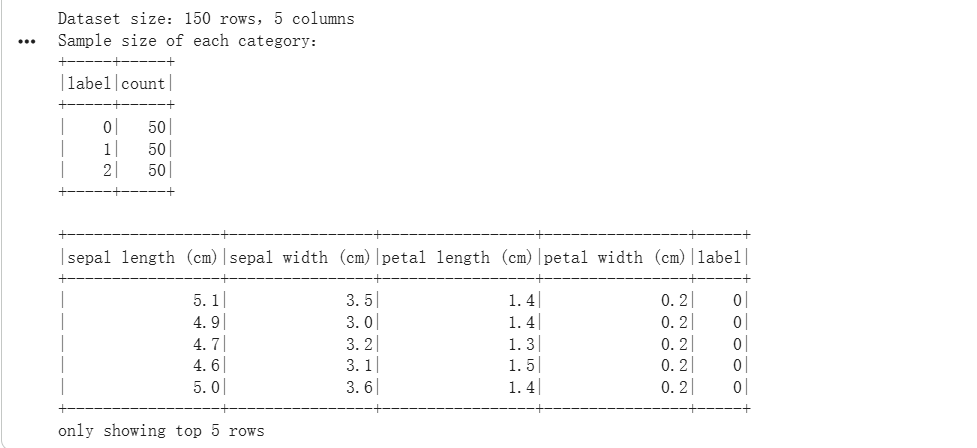
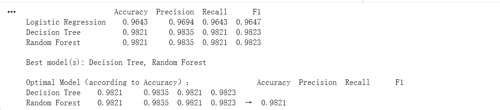
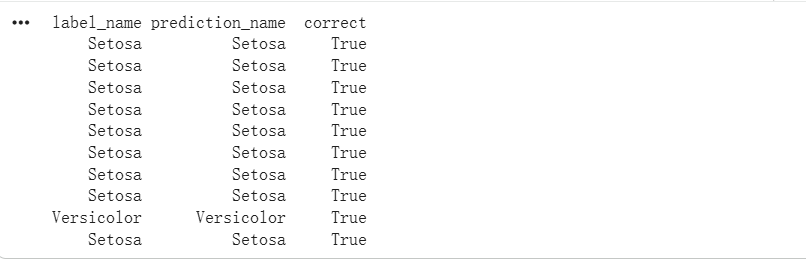

# Assignment 1 - STQD6324 Data Management (Semester 2 2025/2026)

# Iris Classification Using PySpark MLlib

## Table of Contents

* [Overview](#overview)
* [Dataset](#dataset)
* [Methodology](#methodology)
* [Models Used](#models-used)
* [Hyperparameter Tuning](#hyperparameter-tuning)
* [Evaluation Metrics](#evaluation-metrics)
* [Results](#results)
* [Tools and Technologies](#tools-and-technologies)
* [Repository Structure](#repository-structure)
* [How to Reproduce](#how-to-reproduce)
* [Key Findings](#key-findings)

---

## Overview

This project applies **Apache Spark MLlib** to perform multi-class classification on the **Iris dataset**.

The objective is to build, tune, evaluate, and compare different machine learning classification models for predicting iris flower species based on four flower measurements.

Three supervised learning algorithms are implemented:

* Logistic Regression
* Decision Tree
* Random Forest

To improve model performance, **Grid Search** together with **5-fold Cross Validation** is used for hyperparameter tuning. The trained models are then evaluated using multiple performance metrics and compared to determine the most suitable classifier.

---

## Dataset

The project uses the classic **Iris dataset**, one of the most widely used datasets for classification tasks.

### Dataset Information

| Item              | Description                                          |
| ----------------- | ---------------------------------------------------- |
| Total Samples     | 150                                                  |
| Number of Classes | 3 Iris Species                                       |
| Features          | Sepal Length, Sepal Width, Petal Length, Petal Width |

### Data Preprocessing

The following preprocessing steps were performed before model training:

* Exploratory Data Analysis (EDA)
* Missing value checking
* Feature assembly using `VectorAssembler`
* Train/Test split (70% / 30%)

Since the dataset contains **no missing values** and all features are numerical, no additional data cleaning or scaling was required.

---

## Methodology

The complete workflow is illustrated below.

```text
Load Dataset
        │
        ▼
Exploratory Data Analysis (EDA)
        │
        ▼
Missing Value Check
        │
        ▼
Feature Assembly
        │
        ▼
Train/Test Split
        │
        ▼
Model Training
(Logistic Regression / Decision Tree / Random Forest)
        │
        ▼
Hyperparameter Tuning
(Grid Search + 5-Fold Cross Validation)
        │
        ▼
Performance Evaluation
        │
        ▼
Comparative Analysis
        │
        ▼
Prediction & Feature Importance
```

---

## Models Used

### Logistic Regression

A simple linear classification model used as the baseline algorithm.

**Strengths**

* Fast training
* Easy to implement
* Good baseline model

**Limitation**

* Assumes approximately linear decision boundaries.

---

### Decision Tree

A rule-based classifier that recursively splits the feature space.

**Strengths**

* Easy to interpret
* Fast prediction

**Limitation**

* Can easily overfit when the tree becomes too complex.

---

### Random Forest

An ensemble learning algorithm that combines multiple decision trees.

**Strengths**

* High prediction accuracy
* Strong robustness
* Better generalisation performance

**Limitation**

* Higher computational cost
* Less interpretable than a single Decision Tree

---

## Hyperparameter Tuning

Each classifier was optimised using **Grid Search** with **5-fold Cross Validation**.

| Model               | Hyperparameters                   |
| ------------------- | --------------------------------- |
| Logistic Regression | `regParam`, `elasticNetParam`     |
| Decision Tree       | `maxDepth`, `minInstancesPerNode` |
| Random Forest       | `numTrees`, `maxDepth`            |

The optimal hyperparameters were automatically selected based on cross-validation performance.

---

## Evaluation Metrics

The models were evaluated using four commonly used classification metrics.

| Metric    | Description                           |
| --------- | ------------------------------------- |
| Accuracy  | Overall classification accuracy       |
| Precision | Correctness of positive predictions   |
| Recall    | Ability to identify actual classes    |
| F1-score  | Harmonic mean of Precision and Recall |

Using multiple metrics provides a more comprehensive assessment than relying on accuracy alone.

---

## Results

### Performance Comparison

| Model               |   Accuracy |  Precision |     Recall |   F1-score |
| ------------------- | ---------: | ---------: | ---------: | ---------: |
| Logistic Regression | **0.9643** | **0.9694** | **0.9643** | **0.9647** |
| Decision Tree       | **0.9821** | **0.9835** | **0.9821** | **0.9823** |
| Random Forest       | **0.9821** | **0.9835** | **0.9821** | **0.9823** |

### Comparative Analysis

Both Decision Tree and Random Forest achieved the highest evaluation scores on the Iris dataset.

Although both models produced identical testing performance, **Random Forest** is selected as the preferred classifier because ensemble learning generally provides better robustness and stronger generalisation than a single Decision Tree.

Feature importance analysis also indicates that **petal-related measurements are more important than sepal-related measurements**, which agrees with the known characteristics of the Iris dataset.

---

## Tools and Technologies

* Python
* PySpark
* Apache Spark MLlib
* Pandas
* Matplotlib
* Scikit-learn
* Jupyter Notebook

---

## Repository Structure

```text
Assignment01_STQ6324_SEM2_20252026.ipynb
README.md
iris.csv
```

---

## How to Reproduce

### 1. Clone the repository

```bash
git clone https://github.com/p161565-Lucas/Assigment1-STQD6324-Data-Management-SEMESTER-2-2025-2026.git
```

### 2. Move into the project directory

```bash
cd Assigment1-STQD6324-Data-Management-SEMESTER-2-2025-2026
```

### 3. Install the required packages

```bash
pip install pyspark pandas matplotlib scikit-learn
```

### 4. Launch Jupyter Notebook

```bash
jupyter notebook Assignment01_STQ6324_SEM2_20252026.ipynb
```

### 5. Execute the notebook

Run all cells sequentially from top to bottom to reproduce:

* Data preprocessing
* Exploratory Data Analysis
* Model training
* Hyperparameter tuning
* Performance evaluation
* Comparative analysis
* Feature importance analysis
* Prediction results

---

## Key Findings

* All three Spark MLlib classifiers achieved excellent performance on the Iris dataset.
* Hyperparameter tuning using Grid Search and 5-fold Cross Validation improved model reliability.
* Decision Tree and Random Forest achieved the highest evaluation scores.
* Random Forest was selected as the preferred model because of its stronger robustness and better generalisation capability.
* Petal-related features were identified as the most influential variables for iris species classification.
* This project demonstrates the effectiveness of Apache Spark MLlib for scalable machine learning classification tasks.

---

## Project Gallery

| Dataset Overview | Model Comparison |
|-----------------|------------------|
|  |  |

| Feature Importance | Prediction Results |
|-------------------|--------------------|
|  |  |
